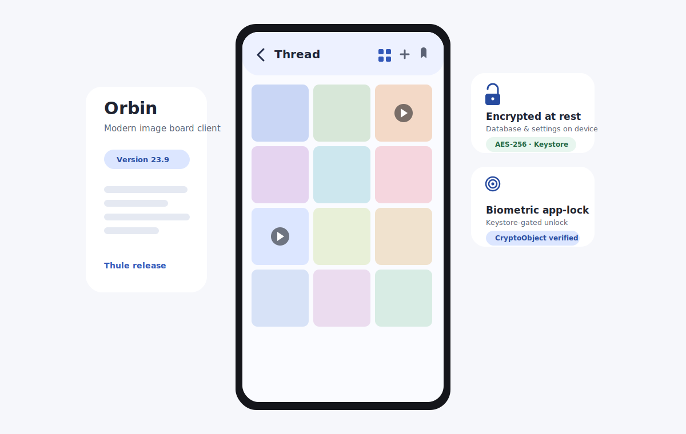
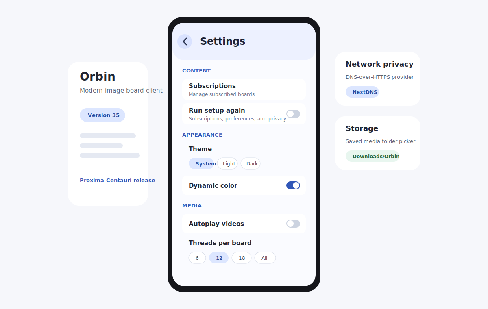

# Orbin

A modern, fast, and beautiful open-source **Android image board client**, built with Kotlin,
Jetpack Compose, and Material 3. Orbin targets **Android 15+ (API 35+)** and is engineered around
a strict, modular Clean Architecture so that supporting a new image board engine is a matter of
implementing a single interface.

**Website:** https://defuuls.github.io/Orbin/

**Current release:** [v48 — Sirius B](https://github.com/Defuuls/Orbin/releases/tag/v48-Sirius-B)

**Available providers:** 4chan (Vichan), BBW Chan (LynxChan), 8kun (LynxChan)

> **Status:** under active development, with regular signed releases. The architecture, build
> system, domain core, networking, media pipeline, encrypted data layer, and the reference
> provider are in place; features continue to land incrementally. See [CHANGELOG.md](CHANGELOG.md).





---

## Features

**Browsing**
- Multi-provider support through a clean provider abstraction (4chan via Vichan and BBW Chan via
  LynxChan included; additional imageboards can be added without modifying app code).
- Board list, catalog with sorting, and a rich thread viewer with post dates.
- Subscribed feed with tap-to-top chrome, optional full-screen scrolling, and an adaptive
  tablet dock that keeps navigation close without crowding the feed.

**Thread viewer**
- Structured reply tree with quote links, quote previews, and backlinks.
- Inline images and video, collapsible replies, and thread stats.
- A thumbnail-only grid view that shows every attachment in the thread at a glance.
- Reading history with unread indicators and scroll-position restore.

**Media**
- Hardware-accelerated image and video, progressive loading, pinch-zoom, swipe gallery,
  background preloading, autoplay + mute toggle, fullscreen playback, auto-rotate video, and a
  native download manager.

**Personalization**
- Material 3 with dynamic color, light/dark, and AMOLED-black themes, plus 20+ ported imageboard
  color palettes (Yotsuba, Tomorrow, Miku, Lain, Penumbra, Windows 95, and more).
- Adaptive layouts for tablets, foldables, landscape, and edge-to-edge.
- Tablet feed rows use an old-Reddit-style thumbnail-and-text layout for faster scanning on
  larger screens.
- Predictive back gesture and smooth shared-element transitions.

**Privacy & security**
- **Encrypted at rest:** the local database (history, bookmarks, downloads, searches) is encrypted
  with SQLCipher and app settings with an encrypted DataStore, both protected by a hardware-backed
  Android Keystore key — so a copy of the app's data directory is only ciphertext.
- **Biometric app-lock** gated on a Keystore-backed cryptographic operation (not just the prompt
  callback), plus `FLAG_SECURE` to keep locked content out of the recents preview.
- HTTPS-only networking enforced end-to-end, optional DNS-over-HTTPS, and a configurable
  user-agent. Cloud backup and device-transfer of local data are disabled.

## Tech stack

| Concern | Choice |
| --- | --- |
| Language | Kotlin 2.4.0 (K2), Coroutines 1.11, Flow/StateFlow, Serialization |
| UI | Jetpack Compose (BOM 2026.06), Material 3, Navigation Compose, Paging 3 |
| DI | Hilt |
| Persistence | Room + SQLCipher, encrypted DataStore |
| Networking | OkHttp 5, Retrofit, kotlinx.serialization |
| Media | Coil 3.5 (images), Media3/ExoPlayer (video) |
| Background | WorkManager |
| Quality | detekt, ktlint, JUnit, Turbine, MockK, Truth, Robolectric, Roborazzi |

## Module structure

```
Orbin/
├── app/                      # Application, MainActivity, navigation host, DI aggregation
├── build-logic/              # Gradle convention plugins (the build's backbone)
├── core/
│   ├── common/               # Result types, dispatchers, NetworkMonitor
│   ├── model/                # Pure domain entities (no Android deps)
│   ├── designsystem/         # Theme, color, typography, reusable components
│   ├── ui/                   # Shared Compose UI building blocks
│   └── testing/              # Test fixtures and rules
├── domain/                   # Repository contracts + use cases (pure logic)
├── data/                     # Room, DataStore, Paging, repository implementations
├── network/                  # OkHttp/Retrofit, DoH, connectivity
├── media/                    # Coil 3 + Media3 integration, download manager
├── provider/
│   ├── api/                  # The ImageBoardProvider SPI (pure Kotlin)
│   ├── vichan/               # 4chan provider (vichan/4chan-compatible JSON)
│   └── lynxchan/             # BBW Chan provider (LynxChan JSON)
└── feature/                  # home, board, thread, search, bookmarks, history,
                              # settings, gallery, downloads
```

See [docs/architecture/README.md](docs/architecture/README.md) for the dependency graph and design
rationale, and [docs/provider-api/adding-a-provider.md](docs/provider-api/adding-a-provider.md) to
add a new engine.

## Build instructions

**Requirements**
- JDK 17+
- Android SDK with API 35 (`compileSdk`/`minSdk` = 35)
- Android Studio Ladybug+ (or the command line below)

**Common tasks**
```bash
./gradlew assembleDebug          # build the debug APK
./gradlew test                   # JVM unit tests across all modules
./gradlew detekt ktlintCheck     # static analysis & formatting
./gradlew :app:installDebug      # install on a connected device/emulator
```

The build uses a Gradle version catalog (`gradle/libs.versions.toml`) and convention plugins in
`build-logic/`; module build files stay intentionally small (often three lines).

## Contributing

Contributions are welcome — please read [CONTRIBUTING.md](CONTRIBUTING.md) and the
[development setup](docs/development-setup.md). By contributing you agree your work is licensed
under the project's MIT license.

## License

Orbin is released under the [MIT License](LICENSE).
