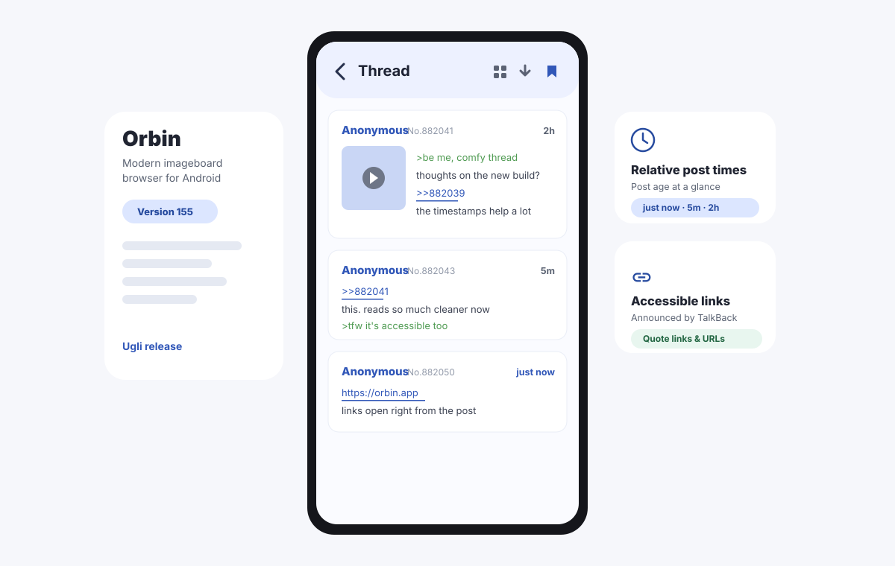

# Orbin


Orbin is a modern, privacy-focused, open-source **Android imageboard browser** built with Kotlin,
Jetpack Compose, and Material 3 Expressive. It targets **Android 12+ (API 31+)** and uses a modular Clean
Architecture with engine-specific behavior isolated behind a provider contract.

Orbin is deliberately **read-only**: it browses boards, catalogs, threads, links, and media, but
does not post, reply, or create threads.

**Website:** https://defuuls.github.io/Orbin/

**Current release:** [149 — Orange](https://github.com/Defuuls/Orbin/releases/tag/v149-Orange)

**What's new in 149:** Orbin tells you about new releases and installs them from the app.

**Providers:** 4chan (Vichan-compatible reference provider) and BBW Chan (LynxChan)

**Brand:** [identity and logo usage](docs/brand.md)

> Orbin is under active development with signed releases, automated quality gates, encrypted
> local persistence, provider contract validation, and a UI designed to remain readable from
> compact phones through tablets and foldables.





---

## What Orbin does

### Browsing

- **Multi-provider architecture.** Vichan/4chan-compatible and LynxChan engines ship today. New
  engines plug into `ImageBoardProvider` instead of leaking engine rules into the app.
- **Subscribed feed.** Threads from followed boards are grouped by board A–Z, most recently
  active first within each board, with read state, filtering, pull-to-refresh, and inline playback.
- **Readable grid-first catalogs.** Feed and board catalogs use an adaptive card grid as the
  primary presentation. Cards maintain useful width on compact phones, prioritize the subject over
  secondary metadata, and adapt across larger screens.
- **Uncropped previews.** Each card shows the OP's media whole, sized to its own aspect ratio,
  instead of a centre crop.
- **Wide-screen two-pane navigation.** At 840dp and above, a board catalog and its open thread can
  remain side by side without losing navigation state.
- **Offline awareness.** Network state and typed failures are surfaced explicitly rather than
  turning failed requests into unexplained blank screens.
- **Three tabs.** Feed, Media and Boards make up the bottom navigation. Settings opens from the gear
  in the Feed header, and holds only a few rows. Search opens from Boards, and saved files open from Media.

### Thread reader

- Structured posts with greentext, quote links, quote previews, backlinks, spoilers, formatting,
  external links, and cross-board references.
- Inline images/video, multi-attachment carousels, collapsible posts, thread statistics, and a
  dedicated Files view for scanning every attachment.
- Reading history and persistent scroll-position restore.
- Watch threads and receive new-reply notifications.
- **Save links.** Thread external links can be deduplicated and exported as a plain-text file to
  `Downloads/Orbin`.
- Download thread media into `Downloads/Orbin`, organised by board and thread.

### Media

- Coil 3 image loading and Media3 video playback with caching, progressive loading, zoom,
  swipe-gallery navigation, preloading, autoplay, mute controls (an unmute carries to the next
  video until Orbin closes), double-tap to skip 5 seconds, fullscreen playback, and native downloads.
- **All media** provides one continuous wall of media discovered across board catalogs.
- Optional **deep scan** follows threads to discover media attached to replies.
- Download organization can be flat, by board, by thread, or board then thread.

### Personalization and accessibility

- **Material 3 Expressive redesign.** Flat, matte surfaces, tonal selection containers (`primaryContainer`),
  expressive shape scale (24dp cards, 28dp sheets), and `SpringSpec` physics seeded from a soft eggplant
  palette (`#7B4F8A`).
- Dynamic color, light/dark/AMOLED modes, global font scaling, and Color themes
  (Yotsuba, Warosu, Miku, Lain, and more) that recolor the Next shell including Feed.
- **Cosmic orbit app icon.** Stylized planetary orbit mark with deep space hues and monochrome
  themed launcher icon support.
- Adaptive layouts for compact phones, tablets, foldables, landscape, and edge-to-edge windows.
- Read/unread hierarchy, screen-reader semantics, touch-target and contrast checks, and screenshot
  coverage for normal, dark, AMOLED, large-text, and maximum-text configurations.
- Settings and commands are searchable rather than requiring users to memorize where controls live.

### Privacy and security

- Room data is encrypted with SQLCipher and preferences use encrypted DataStore storage protected
  by Android Keystore material.
- Optional biometric app lock uses a Keystore-backed cryptographic gate; `FLAG_SECURE` protects
  locked content from recents previews.
- HTTPS-only application networking, encrypted DNS with system-resolver fallback when a network
  blocks DoH, and configurable user-agent behavior.
- Android cloud backup/device transfer of private local state is disabled.
- Explicit backup/restore exports are user-controlled. Backup JSON and exported link files are
  plaintext, so store them somewhere you trust.

## Architecture at a glance

```text
UI / ui-next
      ↓
feature modules
      ↓
    domain
      ↓
repository contracts
      ↓
data / network / media
      ↓
provider registry
      ↓
provider:vichan | provider:lynxchan
```

`ui-next` is intentionally app-agnostic: screens consume plain presentation data and callbacks.
Feature modules own ViewModels and mapping. Provider implementations own engine quirks. Shared
provider output contracts are validated at the registry boundary.

The repository also has executable architecture rules. CI runs `scripts/validate_architecture.py`
to catch forbidden dependency directions, cycles, and source-boundary leaks before they become
review conventions that slowly decay.

See [`docs/architecture/README.md`](docs/architecture/README.md),
[`docs/architecture/module-map.md`](docs/architecture/module-map.md), and
[`docs/architecture/quality-gates.md`](docs/architecture/quality-gates.md).

## Module map

```text
Orbin/
├── app/                      # Application shell, navigation, DI aggregation
├── app-ios/                  # iOS app (Kotlin): wires shared providers and screens
├── iosApp/                   # iOS app (Xcode, generated by XcodeGen)
├── domain/                   # Core models, policies, repository contracts
├── data/                     # Persistence/repository implementation
├── network/                  # HTTP clients and transport helpers
├── media/                    # Image/video/download infrastructure
├── ui-next/                  # App-agnostic Compose screen kit
├── feature-*/                # Feature ViewModels and presentation mapping
├── provider/
│   ├── api/                  # Provider contracts and shared models
│   ├── vichan/               # 4chan/Vichan reference implementation
│   ├── lynxchan/             # BBW Chan/LynxChan implementation
│   └── registry/             # Provider registration and contract checks
└── core/                     # Common utilities, models, UI primitives, design system
```

## Quality gates

Every meaningful change is expected to survive the same layered checks used for releases:

- architecture validation and repository consistency
- ktlint and detekt
- Android Lint
- JVM/unit and provider-contract tests
- instrumentation tests
- screenshot/Roborazzi verification where UI behavior changes
- CodeQL security analysis

See [`docs/architecture/quality-gates.md`](docs/architecture/quality-gates.md) and
[`docs/wiki/Developer-Guide.md`](docs/wiki/Developer-Guide.md) for local commands and expectations.

## Building

Orbin uses the Gradle wrapper. A JDK 17 installation is recommended.

```bash
./gradlew assembleDebug
```

For the full local check suite:

```bash
bash scripts/check.sh
```

### iOS

The iOS app shares the models, providers and screens with Android through Kotlin Multiplatform
and is distributed through TestFlight. Building it needs a Mac with Xcode; see
[`docs/ios.md`](docs/ios.md).

## License

See [LICENSE](LICENSE).
