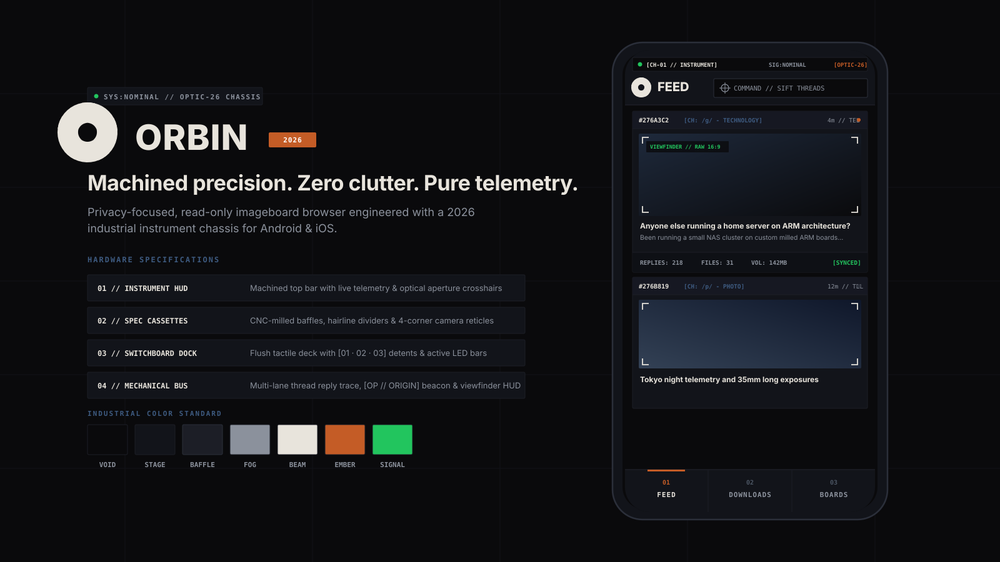

# Orbin



Orbin is a privacy-focused, read-only **Android and iOS imageboard browser** built with Kotlin Multiplatform, Compose Multiplatform, and an authentic **Instagram-style visual layout**. It browses boards, catalogs, threads, links, and media with edge-to-edge elegance, zero distraction, and strictly read-only security.

[Website](https://defuuls.github.io/Orbin/) · [Architecture](docs/architecture/README.md) · [Developer Guide](docs/wiki/Developer-Guide.md) · [iOS Build](docs/ios.md) · [Authentication](docs/authentication.md) · [Brand](docs/brand.md) · [Privacy](PRIVACY.md) · [Security](SECURITY.md)

**Current release:** [193 — Purslane](https://github.com/Defuuls/Orbin/releases/tag/v193-Purslane)

**What's new in 193:** Configurable screen privacy shield, encrypted DNS resolver selection, and incognito controls across Android and iOS.

---

## Highlights

| Area | Capabilities |
| :--- | :--- |
| **Instagram Design & Layout** | Authentic Instagram look and feel across Android and iOS — bold top brand header, horizontal Stories tray carousel with iconic gradient rings (`#FBAA47`, `#D91A46`, `#A60F93`) for boards, edge-to-edge full-bleed media cards, author headers with story ring avatars, interactive Like hearts (`#ED4956`), comment bubble actions, bookmark ribbons, and clean docked bottom navigation bar (`52dp`). |
| **Browsing & Feed** | Instagram feed cards with uncropped media previews, interactive engagement bar, bold like counts, expandable captions, direct comment navigation, A–Z subscribed board feed, and 840dp+ two-pane split view. |
| **Thread Reader & Comments** | Instagram-styled comment reel layout with author badge for OP, circular author avatars, comment like hearts, inline quote expansion, backlinks, spoilers, multi-attachment carousels, and Files sheet. |
| **Media & Hardware Performance** | Coil 3 images + Media3 / AVPlayer video with hardware caching, preloading, swipe gallery, double-tap seek, persistent session unmute, board media walls, optional deep-scan media discovery, and organized downloads (`Downloads/Orbin`). |
| **Themes & Ergonomics** | Pure white (`#FFFFFF`) and pure black (`#000000`) canvas, Royal Blue (`#0095F6`) and Crimson (`#ED4956`) accents, eight calibrated color themes, Light / Dark / AMOLED modes, and accessible tactile controls. |
| **Privacy & Security** | SQLCipher-encrypted Room database, Keystore-backed encrypted preferences & biometric app lock, recents privacy shield (`FLAG_SECURE`), HTTPS-only transport with DoH fallback, and zero telemetry or cloud backups. |
| **Providers** | Engine-agnostic `ImageBoardProvider` contract shipping **4chan** (`provider:vichan`) and **BBW Chan** (`provider:lynxchan`). |

---

## Architecture & Module Map

```text
ui-next (app-agnostic Compose screens)
  ↓
feature/* (Android ViewModels)  |  app-ios (iOS presenters & navigation)
  ↓
domain / core:model (models, policies, repository contracts)
  ↓
storage / core:data / data / network / media
  ↓
provider:api → provider:vichan | provider:lynxchan
```

```text
Orbin/
├── app/                 # Android application shell, navigation, Hilt DI
├── app-ios/             # iOS shared Kotlin application, navigation, and presenters
├── iosApp/              # iOS Xcode project (generated via XcodeGen)
├── ui-next/             # App-agnostic Compose Multiplatform screen kit
├── feature/             # Android feature modules (home, board, thread, gallery, downloads, search, settings, onboarding)
├── domain/              # Domain policies, use cases, and repository contracts
├── storage/             # Multiplatform Room database, DAOs, and repository implementations
├── data/                # Android encryption, background workers, and platform repositories
├── network/             # Android OkHttp / Retrofit transport and interceptors
├── media/               # Coil 3 image loader, Media3 video player, preloader, and downloader
├── provider/            # Engine contracts (:api) and implementations (:vichan, :lynxchan)
└── core/                # Shared KMP primitives (:common, :model, :data, :network, :designsystem, :ui, :testing, :graph)
```

Architecture boundaries are enforced in CI via `scripts/validate_architecture.py`. See [`docs/architecture/README.md`](docs/architecture/README.md) and [`docs/architecture/module-map.md`](docs/architecture/module-map.md) for details.

---

## Quick Start

Requires **JDK 17+**. Build the debug APK or run the full verification suite (architecture, repo consistency, ktlint, detekt, Android Lint, unit tests, and Kover coverage):

```bash
# Build Android debug APK
./gradlew assembleDebug

# Run all quality gates
bash scripts/check.sh
```

For iOS builds (requires macOS + Xcode), see [`docs/ios.md`](docs/ios.md). For testing and quality gates, see [`docs/architecture/quality-gates.md`](docs/architecture/quality-gates.md) and [`docs/wiki/Developer-Guide.md`](docs/wiki/Developer-Guide.md).

## License

See [LICENSE](LICENSE).
