# Orbin Android vs iOS Continuity & Parity Analysis

This report provides a continuity audit comparing the **Android** and **iOS** versions of **Orbin**, evaluating architecture, UI parity, media playback, background tasks, data persistence, and runtime performance.

---

## 1. Executive Summary & Architecture Overview

Orbin achieves cross-platform continuity through a shared Kotlin Multiplatform (KMP) core and Compose Multiplatform UI ([`ui-next`](file:///c:/Users/Daddy/Downloads/Orbin/ui-next)), while tailoring platform integrations (video playback, biometrics, file persistence, and background tasks) to native system idioms.

```mermaid
flowchart TD
    subgraph Shared Core & UI
        Storage[":storage (Room 2.7 KMP & DataStore)"]
        Domain[":domain & :core:model"]
        Providers[":provider:vichan & :provider:lynxchan"]
        Network[":network (Ktor HTTP Client)"]
        UiNext[":ui-next (Compose Multiplatform Screens & Design Tokens)"]
    end

    subgraph Android Host [":app"]
        NavCompose["Navigation Compose (Type-safe Routes)"]
        Hilt["Hilt DI"]
        Media3["Media3 / ExoPlayer (PiP, Loop, Scrubbing)"]
        AndroidDM["System DownloadManager & SAF"]
        WorkMgr["WorkManager (Watched Threads)"]
        KeyStore["KeyStore + Strong BiometricPrompt"]
        SqlCipher["SQLCipher Database Encryption"]
    end

    subgraph iOS Host [":app-ios"]
        BrowserState["Browser.kt State Controller"]
        AppGraph["AppGraph Manual DI"]
        AVPlayer["AVPlayerViewController + WKWebView"]
        PhotoLib["Apple Photos & Files App (PHPhotoLibrary)"]
        BGTask["BGAppRefreshTask (Watched Threads)"]
        LAContext["LocalAuthentication (Face ID / Touch ID)"]
        DataProtection["iOS File Protection at Rest"]
    end

    UiNext --> NavCompose
    UiNext --> BrowserState
    Storage --> SqlCipher
    Storage --> DataProtection
```

---

## 2. Feature & UX Parity Matrix

| Capability / Screen | Android Implementation | iOS Implementation | Parity Assessment |
|---|---|---|---|
| **Design System & Styling** | [`NextTheme`](file:///c:/Users/Daddy/Downloads/Orbin/ui-next/src/commonMain/kotlin/com/orbin/uinext/Theme.kt), dark/light/AMOLED, token-based spacing & elevation | Shared [`NextTheme`](file:///c:/Users/Daddy/Downloads/Orbin/ui-next/src/commonMain/kotlin/com/orbin/uinext/Theme.kt), dark/light/AMOLED, identical token palettes | **100% Identical** |
| **Feed Screen** | `Route.NextFeed` via Compose Nav, multi-column grid, pull-to-refresh with haptics, site switcher segment | [`FeedDestination`](file:///c:/Users/Daddy/Downloads/Orbin/app-ios/src/commonMain/kotlin/com/orbin/ios/OrbinApp.kt#L141-L174) via [`Browser`](file:///c:/Users/Daddy/Downloads/Orbin/app-ios/src/commonMain/kotlin/com/orbin/ios/Browser.kt), identical grid & column formulas, pull-to-refresh haptics | **100% Identical** |
| **Tablet / Foldable (2-Pane)** | Dual-pane split view (`TWO_PANE_MIN_WIDTH = 840dp` in [`OrbinApp.kt`](file:///c:/Users/Daddy/Downloads/Orbin/app/src/main/kotlin/com/orbin/app/OrbinApp.kt#L142)): catalog on left, selected thread on right via [`BoardDetailTwoPane`](file:///c:/Users/Daddy/Downloads/Orbin/app/src/main/kotlin/com/orbin/app/navigation/BoardDetailTwoPane.kt) | Responsive multi-column layout on iPad, but full-screen thread navigation only (no 2-pane split) | **Discrepancy (Tablet UX)** |
| **Network & Offline Status** | Floating animated [`OfflineBanner`](file:///c:/Users/Daddy/Downloads/Orbin/app/src/main/kotlin/com/orbin/app/OrbinApp.kt#L116-L128) at top; gracefully floats without layout jump | Card-level error state on failed requests; no persistent global offline banner | **Minor Discrepancy** |
| **Board Browser & Catalog** | Multi-column grid, sort switcher, unread counts, followed toggle, hide NSFW | Multi-column grid, sort switcher, unread counts, followed toggle, hide NSFW in [`CatalogDestination`](file:///c:/Users/Daddy/Downloads/Orbin/app-ios/src/commonMain/kotlin/com/orbin/ios/OrbinApp.kt#L382-L425) | **100% Identical** |
| **Thread View & Navigation** | [`NextThreadScreen`](file:///c:/Users/Daddy/Downloads/Orbin/feature/thread/src/main/kotlin/com/orbin/feature/thread/NextThreadScreen.kt), quote tapping jumps to post, spoiler blur reveal, native Share Sheet | [`ThreadDestination`](file:///c:/Users/Daddy/Downloads/Orbin/app-ios/src/commonMain/kotlin/com/orbin/ios/OrbinApp.kt#L457-L481), quote tapping jumps to post, spoiler blur reveal, native Share Sheet | **100% Identical** |
| **Media Gallery / Viewer** | [`GalleryScreen`](file:///c:/Users/Daddy/Downloads/Orbin/feature/gallery/src/main/kotlin/com/orbin/feature/gallery/GalleryScreen.kt), ExoPlayer, seek slider, mute/loop toggle, 10s skip + haptics, PiP | [`MediaViewer`](file:///c:/Users/Daddy/Downloads/Orbin/app-ios/src/commonMain/kotlin/com/orbin/ios/MediaViewer.kt), AVPlayer / WKWebView, pinch-to-zoom, tap toggle chrome | **Moderate Parity** |
| **Inline Video Previews** | Silent looping inline video previews in catalog cards via [`InlineLoop`](file:///c:/Users/Daddy/Downloads/Orbin/media/src/main/kotlin/com/orbin/media/video/InlineLoop.kt) | Static thumbnail only ([`CatalogThumbnail`](file:///c:/Users/Daddy/Downloads/Orbin/app-ios/src/commonMain/kotlin/com/orbin/ios/OrbinApp.kt#L428-L454) renders `AsyncImage`) | **Feature Gap on iOS** |
| **Downloads & Storage** | System `DownloadManager` (background service, progress notifications, SAF folders) | In-app Ktor fetch to Apple Photos ([`DeviceMediaStore`](file:///c:/Users/Daddy/Downloads/Orbin/app-ios/src/iosMain/kotlin/com/orbin/ios/DeviceMediaStore.kt)) & Files app | **Architectural Difference** |
| **Watched Threads / Notifications** | `WorkManager` periodic refresh, notification channel with thread deep-linking via [`AndroidThreadNotifier`](file:///c:/Users/Daddy/Downloads/Orbin/data/src/main/kotlin/com/orbin/data/notification/AndroidThreadNotifier.kt) | [`BackgroundRefresh`](file:///c:/Users/Daddy/Downloads/Orbin/app-ios/src/iosMain/kotlin/com/orbin/ios/BackgroundRefresh.kt) periodic refresh, `UNUserNotificationCenter` with thread routing via [`IosThreadNotifier`](file:///c:/Users/Daddy/Downloads/Orbin/app-ios/src/iosMain/kotlin/com/orbin/ios/IosThreadNotifier.kt) | **High Parity** |
| **Biometric Security** | KeyStore-backed `BiometricPrompt` (`BIOMETRIC_STRONG`) via [`AppLockCrypto`](file:///c:/Users/Daddy/Downloads/Orbin/app/src/main/kotlin/com/orbin/app/AppLockCrypto.kt), `FLAG_SECURE` window | `LAContext` Face ID/Touch ID with passcode fallback via [`DeviceOwnerAuthenticator`](file:///c:/Users/Daddy/Downloads/Orbin/app-ios/src/iosMain/kotlin/com/orbin/ios/DeviceOwnerAuthenticator.kt), `LockCover` overlay | **High Parity** |
| **Backup & Restore** | JSON export/import via Storage Access Framework | JSON export/import via Files document picker in [`DeviceBackupFiles`](file:///c:/Users/Daddy/Downloads/Orbin/app-ios/src/iosMain/kotlin/com/orbin/ios/DeviceBackupFiles.kt) | **100% Interoperable** |

---

## 3. Deep Dive: Media Playback & Controls

### Android
- **Engine**: ExoPlayer / Media3 in [`VideoPlayer.kt`](file:///c:/Users/Daddy/Downloads/Orbin/media/src/main/kotlin/com/orbin/media/video/VideoPlayer.kt).
- **Codec Handling**: Native hardware VP8, VP9, AV1, H.264, H.265 decoders.
- **Controls**: Interactive time scrubbing ([`NextSlider`](file:///c:/Users/Daddy/Downloads/Orbin/ui-next/src/commonMain/kotlin/com/orbin/uinext/Controls.kt)), elapsed and remaining timestamps, loop toggle, audio mute toggle, and double-tap 10-second fast-forward / rewind with haptic feedback.
- **Audio Focus**: Automatically requests and abandons audio focus (`handleAudioFocus = true`).
- **Picture-in-Picture (PiP)**: Supports system PiP with automatic entry on Android 12+ (`setAutoEnterEnabled(true)`) respecting video aspect ratios.
- **Inline Loops**: [`InlineLoop.kt`](file:///c:/Users/Daddy/Downloads/Orbin/media/src/main/kotlin/com/orbin/media/video/InlineLoop.kt) provides silent, battery-efficient looping previews directly within feed/catalog cards.

### iOS
- **Engine**: Hybrid architecture in [`Player.ios.kt`](file:///c:/Users/Daddy/Downloads/Orbin/app-ios/src/iosMain/kotlin/com/orbin/ios/Player.ios.kt):
  - **MP4 / MOV**: Hosted `AVPlayerViewController` via `UIKitViewController`. Plays with `AVAudioSessionCategoryPlayback` (sound persists through silent switch).
  - **WebM**: `WKWebView` (`NativeWebMPlayer`) for iOS 17.4+ where WebKit introduced native WebM container decoding.
- **Controls**: Default system iOS playback controls on MP4; browser-hosted player for WebM.
- **Looping**: Plays once and pauses at end by default.
- **Inline Loops**: Disabled on iOS; catalog cards display high-resolution static thumbnails only.

---

## 4. Deep Dive: Downloads & Background Processing

### Android
- Utilizes the Android OS system `DownloadManager`.
- Transfers execute out-of-process; if the user terminates Orbin, downloads continue uninterrupted.
- Shows native OS download progress in the notification shade.
- Automatically handles network transitions (e.g. WiFi to cellular and retry).
- [`DownloadCompleteReceiver`](file:///c:/Users/Daddy/Downloads/Orbin/data/src/main/kotlin/com/orbin/data/receiver/DownloadCompleteReceiver.kt) synchronizes Room download records when downloads complete in the background.

### iOS
- iOS does not offer an OS-level Download Manager daemon; downloads are handled in-app via Ktor HTTP client in [`MediaDownloads.kt`](file:///c:/Users/Daddy/Downloads/Orbin/app-ios/src/commonMain/kotlin/com/orbin/ios/MediaDownloads.kt).
- Photos and MP4 videos are saved directly to the device **Photos Library** (`PHPhotoLibrary`), while WebM files are saved to the app's sandboxed document folder visible in the **Files app**.
- If the application is suspended while a download is running, the coroutine is cancelled and marked as `FAILED`. On the next app launch, Orbin automatically presents a retry button for all interrupted downloads.

---

## 5. Deep Dive: Database & Storage Integrity

> [!WARNING]
> **Critical Database Parity Observation**:
> - Both platforms share [`OrbinDatabase`](file:///c:/Users/Daddy/Downloads/Orbin/storage/src/commonMain/kotlin/com/orbin/data/database/OrbinDatabase.kt) (v8) defined in `:storage`.
> - Android uses an encrypted SQLite database via SQLCipher with explicit migrations (`MIGRATION_2_3` through `MIGRATION_7_8`) in [`Migrations.kt`](file:///c:/Users/Daddy/Downloads/Orbin/data/src/main/kotlin/com/orbin/data/database/Migrations.kt).
> - iOS opens `OrbinDatabase` in [`Database.kt`](file:///c:/Users/Daddy/Downloads/Orbin/app-ios/src/iosMain/kotlin/com/orbin/ios/Database.kt) using Room's `BundledSQLiteDriver()`. No migrations are registered with `databaseBuilder`, nor is `fallbackToDestructiveMigration(true)` configured.
> - **Implication**: Any existing iOS installation upgrading from v7 to v8 will encounter a Room migration exception on startup unless migrations or fallback are added to `openDatabase()` in [`Database.kt`](file:///c:/Users/Daddy/Downloads/Orbin/app-ios/src/iosMain/kotlin/com/orbin/ios/Database.kt).

---

## 6. Performance & Rendering Comparison

- **Rendering Engine**:
  - Android executes Jetpack Compose on the Android Runtime (ART) with R8 compiler optimizations and precompiled **Baseline Profiles** ([`baseline-prof.txt`](file:///c:/Users/Daddy/Downloads/Orbin/app/src/release/generated/baselineProfiles/baseline-prof.txt)).
  - iOS executes Compose Multiplatform compiled to native ARM64 code using JetBrains Skiko backed by Apple **Metal** graphics API.
- **Memory & Image Caching**:
  - Both platforms use **Coil 3** (`SingletonImageLoader`) with synchronized cache quotas and shared disk cache policies.
  - Image caches can be manually purged from Settings on both platforms.
- **Haptic Engine**:
  - Both platforms implement comprehensive haptics ([`Haptics.kt`](file:///c:/Users/Daddy/Downloads/Orbin/app-ios/src/commonMain/kotlin/com/orbin/ios/Haptics.kt)): iOS utilizes `UIImpactFeedbackGenerator` / `UINotificationFeedbackGenerator` in [`Haptics.ios.kt`](file:///c:/Users/Daddy/Downloads/Orbin/app-ios/src/iosMain/kotlin/com/orbin/ios/Haptics.kt), while Android uses `Vibrator` / `VibrationEffect` with fallback to `performHapticFeedback` in [`PlatformControls.kt`](file:///c:/Users/Daddy/Downloads/Orbin/ui-next/src/commonMain/kotlin/com/orbin/uinext/PlatformControls.kt).

---

## 7. Recommended Next Steps for iOS Parity

1. **Database Migration Safety**:
   Add `.fallbackToDestructiveMigration(true)` or define KMP Room migrations in [`Database.kt`](file:///c:/Users/Daddy/Downloads/Orbin/app-ios/src/iosMain/kotlin/com/orbin/ios/Database.kt#L26-L32) to ensure seamless upgrades from v7 to v8.
2. **AVPlayer Looping**:
   Add loop notification observer to `AVPlayer` in [`Player.ios.kt`](file:///c:/Users/Daddy/Downloads/Orbin/app-ios/src/iosMain/kotlin/com/orbin/ios/Player.ios.kt#L32-L45) so media loops seamlessly like Android.
3. **iPad 2-Pane Split View**:
   Introduce a split-view mode on iPad (`FormFactor.TABLET`) matching Android's [`BoardDetailTwoPane`](file:///c:/Users/Daddy/Downloads/Orbin/app/src/main/kotlin/com/orbin/app/navigation/BoardDetailTwoPane.kt) layout.
4. **Background Download Hardening**:
   Wrap large file downloads in `beginBackgroundTaskWithName` to prevent suspension during transfers.
