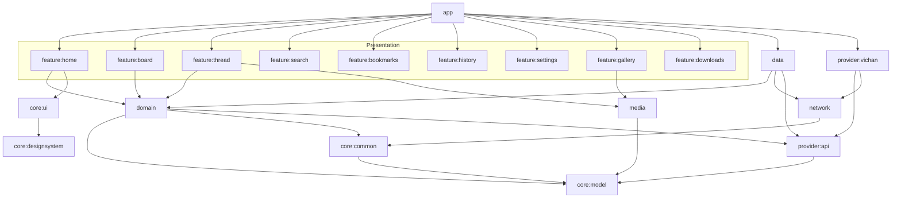

# Architecture

Orbin follows **Clean Architecture** with a strict, compiler-enforced separation of concerns.
Dependencies always point *inward*: outer layers (UI, framework) depend on inner layers
(domain, model), never the reverse.

## Layers

| Layer | Modules | Responsibility | Android? |
| --- | --- | --- | --- |
| Presentation | `app`, `feature:*`, `core:ui`, `core:designsystem` | Compose UI, navigation, ViewModels, immutable UI state | yes |
| Domain | `domain` | Use cases, repository **contracts** | no* |
| Data | `data`, `network`, `media`, `provider:*` | Repository implementations, Room/DataStore, HTTP, engines | yes (except `provider:api`) |
| Model | `core:model` | Pure domain entities shared by all layers | no |
| Cross-cutting | `core:common`, `core:testing` | Result types, dispatchers, test fixtures | yes |

\* `domain` is an Android library only so it can expose Paging types; it contains no Android
framework usage. `provider:api` and `core:model` are pure-JVM modules — the build will fail if an
Android dependency leaks into them, which keeps the boundary honest.

## Module dependency graph

## Key design decisions

### The provider seam
All engine-specific behavior is hidden behind `ImageBoardProvider` (`provider:api`). The app
holds a `Set<ImageBoardProvider>` (Hilt multibinding) and a `ProviderRegistry` resolves the active
one. Adding LynxChan/TinyIB/etc. means adding a `provider:*` module — **nothing else changes**.

### Repository pattern with `OrbinResult`
Repositories return `OrbinResult<T>` (or `Flow<OrbinResult<T>>`) carrying a typed `DataError`,
so the UI branches on failure category (offline / not-found / rate-limited) without catching
exceptions. Providers throw `ProviderException`; the data layer maps those to `DataError` once.

### Offline-first data flow
Reads come from Room first (instant display), then a network refresh updates the cache, which
re-emits through the same `Flow`. Catalogs use Paging 3; threads stream so background refreshes
surface new replies live.

### Parsed comments, not HTML
Engine post HTML is parsed **once** in the data/provider layer into an immutable `PostComment`
tree (`PostNode`). The UI renders that tree to an `AnnotatedString` — fast, testable, and free of
HTML in the presentation layer. Backlinks are computed by inverting forward quote links
(`BuildReplyGraphUseCase`).

### Performance posture
- Immutable, stable UI state (`data class` + `kotlinx.collections.immutable`) to minimize
  recompositions; Compose compiler strong-skipping is on, with metrics emitted to `build/`.
- Lazy lists with stable keys; Paging for catalogs; background parsing on `Dispatchers.Default`.
- Coil 3 memory + disk caching; Media3 for hardware-accelerated playback.

## Testing strategy

| Kind | Tooling | Where |
| --- | --- | --- |
| Unit | JUnit, Truth, MockK, Turbine | `src/test` in every module |
| Repository/DB | Room in-memory, MockWebServer | `data`, `network` |
| UI | Compose UI test, Hilt test runner | `feature:*/src/androidTest` |
| Screenshot | Roborazzi | `core:designsystem`, `feature:*` |

See [adr/](adr) for individual architecture decision records.
