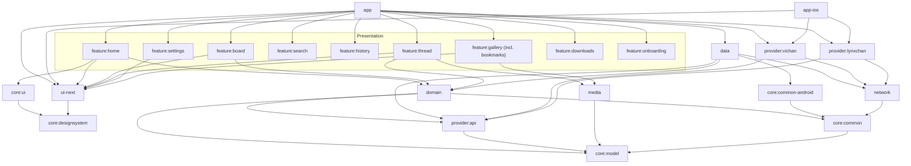

# Architecture

Orbin follows **Clean Architecture** with a strict, compiler-enforced separation of concerns.
Dependencies always point *inward*: outer layers (UI, framework) depend on inner layers
(domain, model), never the reverse.

For a fast orientation before reading implementation code, see the [module map](module-map.md).
The architecture's executable enforcement lives in [engineering quality gates](quality-gates.md).

## Layers

| Layer | Modules | Responsibility | Android? |
| --- | --- | --- | --- |
| Presentation | `app`, `feature:*`, `ui-next`, `core:ui`, `core:designsystem` | Compose UI, navigation, ViewModels, immutable UI state | yes; `ui-next`, `core:ui` and `core:designsystem` shared with iOS† |
| Domain | `domain` | Use cases, repository **contracts** | no* |
| Data | `data`, `storage`, `network`, `media`, `provider:*` | Repository implementations, Room/DataStore, HTTP, engines | `data`, `network`, `media` yes; `storage` shared with iOS‡; `provider:*` no |
| Model | `core:model` | Pure domain entities shared by all layers | no |
| Cross-cutting | `core:common`, `core:common-android`, `core:testing` | Result types, dispatchers, test fixtures | `core:common` no; others yes |

\* `domain`, `provider:*`, `core:common` and `core:model` are Kotlin Multiplatform
(`orbin.kmp.library`: a JVM target for Android plus iOS targets), shared with the iOS app. The
build fails if an Android dependency leaks into them, and the iOS targets reject JVM-only APIs.
They carry no DI annotations: the Hilt bindings for domain use cases live in `data`
(`DomainModule`), the providers are registered in `app` (`ProvidersModule`) over a Ktor
`HttpClient` that `network` builds on the app's OkHttp client, and the Android side of `core:common` — dispatcher qualifiers and their Hilt
module, external links, the app-lock signal — lives in `core:common-android`, which re-exports
`core:common`. `domain` exposes `PagingData` through the multiplatform `paging-common`.

‡ `storage` is the Room database shared with iOS (`orbin.kmp.room`): entities, DAOs, the
`OrbinDatabase` schema (exported to `storage/schemas`) and the repositories built only on it
(bookmarks, history). Only the schema is shared. `data` opens it on Android, encrypted with
SQLCipher, with its migrations and Hilt bindings. `:app-ios` opens it through Room's bundled SQLite
driver. New migrations must use Room's `Migration.migrate(connection)` so they run on both platforms.

† `ui-next`, `core:ui` and `core:designsystem` are Compose Multiplatform (`orbin.kmp.compose`: an Android
library target plus iOS targets). Their code lives in `commonMain`; what differs per platform goes
behind `expect`/`actual` (today dynamic color, which iOS does not have, and locale-formatted dates). `ui-next`'s strings
are Compose resources in `commonMain/composeResources`, read with
`org.jetbrains.compose.resources.stringResource(Res.string.…)`. The host tests still render
through Robolectric, so the screenshot goldens are unchanged by the move.

## Module dependency graph

```mermaid
graph TD
    app --> feature_home & feature_board & feature_thread & feature_search
    app --> feature_history & feature_settings & feature_gallery & feature_downloads & feature_onboarding
    app --> data
    app --> provider_vichan & provider_lynxchan

    subgraph Presentation
      feature_home[feature:home]
      feature_board[feature:board]
      feature_thread[feature:thread]
      feature_search[feature:search]
      feature_history[feature:history]
      feature_settings[feature:settings]
      feature_gallery["feature:gallery (incl. bookmarks)"]
      feature_downloads[feature:downloads]
      feature_onboarding[feature:onboarding]
    end

    feature_home --> domain
    feature_board --> domain
    feature_thread --> domain
    feature_thread --> media
    feature_gallery --> media
    feature_home --> core_ui[core:ui]
    core_ui --> core_designsystem[core:designsystem]

    app --> ui_next[ui-next]
    app_ios[app-ios] --> ui_next
    app_ios --> provider_vichan
    app_ios --> provider_lynxchan
    feature_home --> ui_next
    feature_board --> ui_next
    feature_thread --> ui_next
    feature_settings --> ui_next
    feature_gallery --> ui_next
    ui_next --> core_designsystem

    domain --> core_model[core:model]
    domain --> core_common[core:common]
    domain --> provider_api[provider:api]

    data --> domain
    data --> network
    data --> provider_api
    data --> core_common_android[core:common-android]
    core_common_android --> core_common

    provider_vichan[provider:vichan] --> provider_api
    provider_vichan --> network
    provider_lynxchan[provider:lynxchan] --> provider_api
    provider_lynxchan --> network
    provider_api --> core_model
    media --> core_model
    network --> core_common
    core_common --> core_model
```

## Key design decisions

### The interface seam

`ui-next` holds every screen the app shows. It imports no app type — no model, no repository, no
view model — even though the feature convention plugin puts `core:model` and `core:ui` on its
classpath; the design system is all it actually uses. A screen
takes already-formatted rows and hands back an id; the feature module owns the join to its view
model, and anything behavioural — thumbnails, post bodies, video — is passed in through a slot so
it is the shipped component rather than a copy of one. That is why the same feed row serves the
subscribed feed and every board catalog, why the screens can be screenshot without a view model,
and why a change to how a thread renders cannot reach into how one is loaded.

### The provider seam
All engine-specific behavior is hidden behind `ImageBoardProvider` (`provider:api`). The app
holds a `Set<ImageBoardProvider>` (Hilt multibinding) and a `ProviderRegistry` resolves the active
one. `provider:vichan` (4chan) and `provider:lynxchan` (BBW Chan) are the two engines shipped
today; adding TinyIB/etc. means adding another `provider:*` module — **nothing else changes**.
Every provider result is checked against the shared [provider contract](../provider-api/contract.md)
at the registry boundary. See
[`docs/provider-api/adding-a-provider.md`](../provider-api/adding-a-provider.md).

### Repository pattern with `OrbinResult`
Repositories return `OrbinResult<T>` (or `Flow<OrbinResult<T>>`) carrying a typed `DataError`,
so the UI branches on failure category (offline / not-found / rate-limited) without catching
exceptions. Providers throw `ProviderException`; the data layer maps those to `DataError` once.

### Offline-first data flow
Reads come from Room first (instant display), then a network refresh updates the cache, which
re-emits through the same `Flow`. Catalogs use Paging 3; threads stream so background refreshes
surface new replies live.

### Parsed comments, not HTML
Engine post HTML is parsed **once** in the data/provider layer into an immutable `PostComment`
tree (`PostNode`). The UI renders that tree to an `AnnotatedString` — fast, testable, and free of
HTML in the presentation layer. Backlinks are computed by inverting forward quote links
(`BuildReplyGraphUseCase`).

### Performance posture
- Immutable, stable UI state (`data class` + `kotlinx.collections.immutable`) to minimize
  recompositions; Compose compiler strong-skipping is on, with metrics emitted to `build/`.
- Lazy lists with stable keys; Paging for catalogs; background parsing on `Dispatchers.Default`.
- Coil 3 memory + disk caching; Media3 for hardware-accelerated playback.
- Configuration cache, build cache, parallel Gradle execution and incremental Kotlin compilation
  are enabled repository-wide; CI publishes a module fan-out/source-size summary to keep build
  graph growth visible.

## Testing strategy

| Kind | Tooling | Where |
| --- | --- | --- |
| Pure / contract | JUnit, Truth | `core:model`, `provider:api`, provider fixture tests |
| Unit | JUnit, Truth, MockK, Turbine | `src/test` in every module |
| Repository/DB | Room in-memory, MockWebServer | `data`, `network` |
| UI | Compose UI test, Hilt test runner | `feature:*/src/androidTest` |
| Screenshot | Roborazzi | `ui-next`, `core:designsystem`, `feature:*` |

CI also runs `scripts/validate_architecture.py` before Gradle analysis. This turns dependency and
source-boundary rules into merge gates instead of review conventions.

### Theme layering (Next vs Material)

`MainActivity` installs `NextTheme` once at the root so every Next screen inherits palette and
density without paying a second `MaterialTheme`. Nested no-arg `NextTheme` calls short-circuit.
Reachable destinations draw through `NextTheme`. Nested Material sliders, snackbars, and
pull-to-refresh were replaced with Next controls (`NextSlider`, `NextSnackbarHost`,
`NextPullToRefresh`); the former `MaterialOrbinTheme` adapter was removed. Gallery and onboarding
no longer wrap themselves in a separate Material shell.

### Lazy beyond-bounds prefetch

Compose BOM `2026.08.00` (Foundation 1.12.0) exposes `beyondBoundsItemCount` only on internal
`LazyList` measure paths — not on the public `LazyColumn` / `LazyVerticalGrid` APIs. CI rejected
`beyondViewportItemCount` on grids for the same reason. Feed/media lists therefore keep the landed
soft-cap (`MAX_WALL_ITEMS`), `contentType` keys, and scoped Coil prefetch instead of a non-existent
public beyond-bounds parameter.

### Residual device verification

The following still need a physical **Pixel 10 Pro XL** (or equivalent large high-refresh device)
before treating the punch-list as fully closed:

- Feed fling jank / single-autoplay behavior at 120 Hz with a multi-column grid
- Gallery pager decode caps and thumb→full progressive tiles under real thermal/memory pressure
- Theme nesting (Next vs Material destinations) with dynamic color and AMOLED enabled
- End-to-end HTTPS-only media loads across Vichan and LynxChan boards

Emulator/Roborazzi coverage does not substitute for that device pass.

Individual design decisions and their rationale are recorded chronologically in
[CHANGELOG.md](https://github.com/Defuuls/Orbin/blob/main/CHANGELOG.md) rather than as separate
ADR files — this document is the current-state summary.
