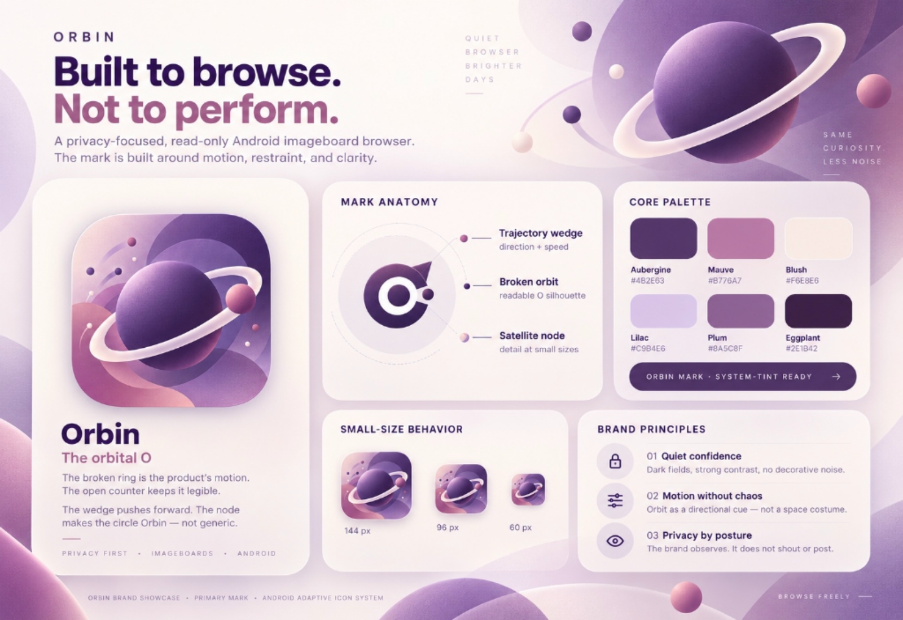

# Orbin brand

Orbin's identity is built around a **broken orbital O**: a compact mark that suggests motion and navigation without turning the product into a literal space theme. The mark is intentionally white-only so it works cleanly across Android adaptive icons, monochrome themed icons, splash screens, documentation, and dark UI surfaces.

## Core idea

**Built to browse. Not to perform.**

Orbin is a privacy-focused, read-only imageboard browser. The brand should feel observant, precise, quiet, and fast rather than social, expressive, or noisy.

## Mark anatomy

- **Broken orbit:** establishes the O silhouette while keeping the form open and directional.
- **Trajectory wedge:** adds forward motion and gives the mark a distinct upper-right profile.
- **Satellite node:** creates an ownable detail that helps the icon remain recognizable at launcher size.
- **Open center:** protects legibility as the mark scales down.

The production Android vector lives at `app/src/main/res/drawable/ic_launcher_orbit_foreground.xml`.

## Color system

| Role | Value | Usage |
| --- | --- | --- |
| Orbit black | `#0D0D11` | Legacy launcher field and deepest brand background |
| Icon field | `#171717` | Primary launcher and splash background |
| Surface | `#212121` | Dark UI and supporting brand surfaces |
| Mark | `#FFFFFF` | Primary logo geometry and monochrome source |

The logo should remain white on dark in first-party brand material. Android may tint the monochrome source automatically for themed icons.

## Usage principles

1. **Quiet confidence.** Favor strong contrast, spacious layouts, and restrained typography over decorative effects.
2. **Motion without chaos.** Orbit-inspired lines and directional cuts can support the identity, but avoid stars, galaxies, rockets, or literal planet illustrations.
3. **Privacy by posture.** The brand observes rather than broadcasts. Copy should be direct, calm, and product-led.
4. **Keep the silhouette intact.** Do not remove the trajectory wedge or satellite node when using the full mark.
5. **Protect small-size clarity.** Avoid outlines, gradients, shadows inside the logo, or added details that disappear at launcher scale.

## Recommended lockups

For repository and product surfaces, pair the icon with a plain **Orbin** wordmark rather than inventing a decorative type treatment. Use bold or semibold sans-serif typography and let the symbol carry the distinctive character.

The primary showcase asset is `docs/assets/orbin-brand-showcase.svg`.
